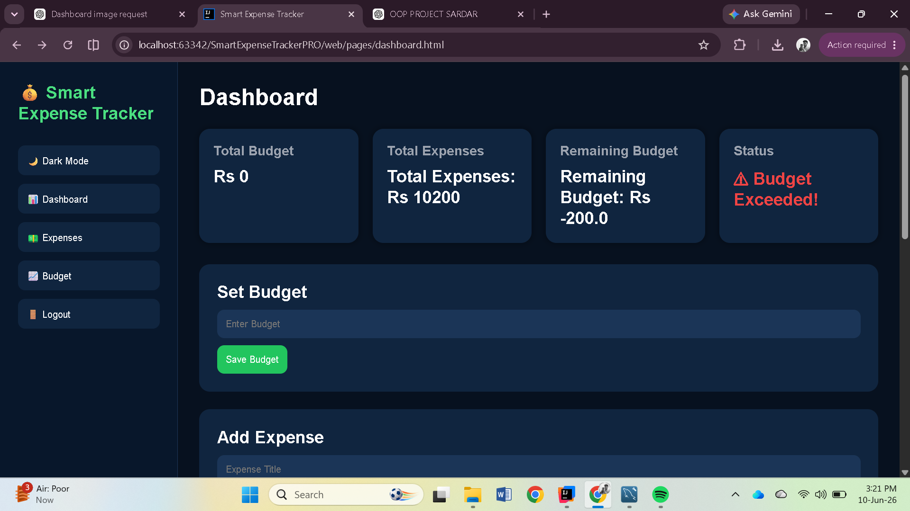
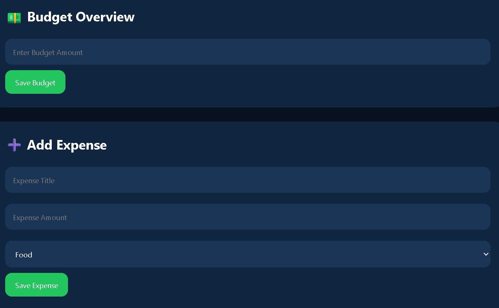
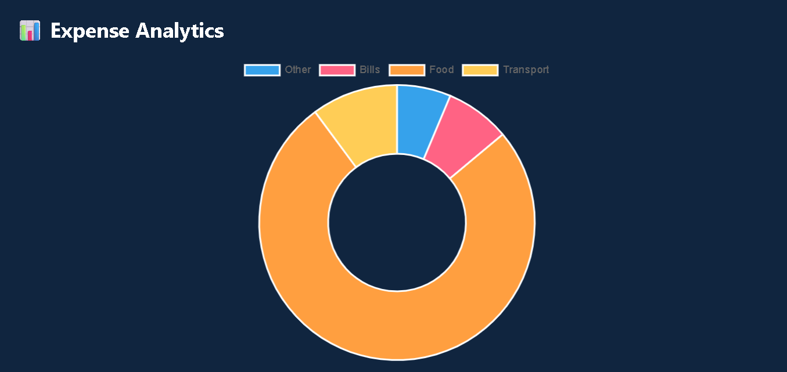
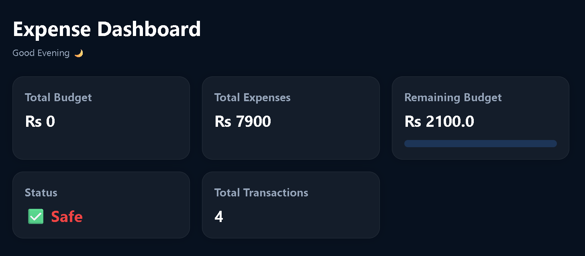
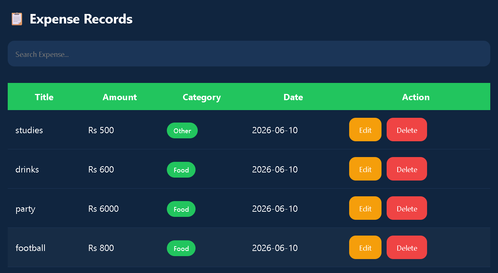

# Smart Expense Tracker Pro

## Overview

Smart Expense Tracker Pro is a personal finance management application designed to help users track, organize, and analyze their daily expenses. The application provides a simple and interactive interface for managing financial records, monitoring budgets, and understanding spending patterns through visual reports.

The project combines a Java-based backend with modern web technologies to deliver a smooth and user-friendly experience while demonstrating the integration of frontend design, backend development, and database management.

## Features

- User registration and login authentication
- Add, edit, and delete expense records
- Categorize expenses for better organization
- Interactive dashboard with financial summaries
- Pie charts and graphical analysis of spending habits
- Budget management and expense monitoring
- Responsive and user-friendly interface
- Secure database integration for storing user data

## Technologies Used

### Backend
- Java
- JavaFX
- Maven
- JDBC

### Frontend
- HTML5
- CSS3
- JavaScript

### Database
- MySQL

## Project Structure

```
SmartExpenseTrackerPRO
│
├── src
│   ├── controllers
│   ├── models
│   ├── dao
│   ├── database
│   └── resources
│
├── web
│   ├── css
│   ├── js
│   └── pages
│
├── images
├── README.md
├── pom.xml
└── .gitignore
```

## Screenshots

### Login Page


### Dashboard



### Budget Management



### Expense Analysis



### Expense Details



### Expense Report



## Future Improvements

- Monthly and yearly financial reports
- Export reports as PDF or Excel
- Dark mode support
- Email notifications and reminders
- AI-powered spending analysis and recommendations
- Cloud synchronization

## Author

**Muhammad Arham**

BS Cyber Security  
University of Engineering and Technology (UET) Lahore